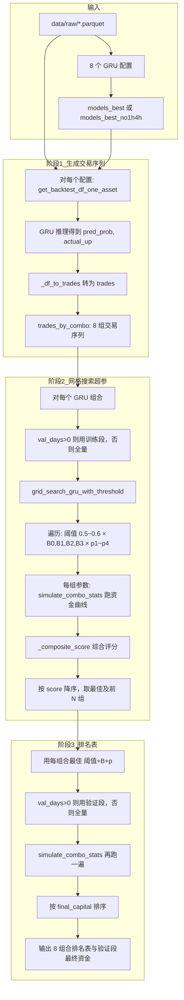
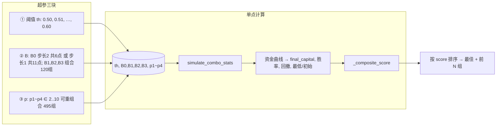

# backtest_tiered_bet_grid 超参与回测流程图

## 一、整体流程图（Mermaid）

## 二、超参搜索流程图（单组合）

## 三、回测逻辑说明

### 3.1 数据来源

- **Parquet**：`data/raw/{asset}_15m.parquet`（如 eth_usdt_15m.parquet），时间范围取该文件 min/max 日期。
- **GRU 推理**：对每个资产+模型目录（models_best 或 models_best_no1h4h）调用 `backtest_gru_regime.get_backtest_df_one_asset`，得到每根 K 线的 `pred_prob`（预测上涨概率）和 `actual_up`（实际是否上涨 0/1）。
- **转为 trades**：每根 K 线一条 trade：`confidence=pred_prob`，`result=win/loss` 由 `actual_up` 决定，`amount=1.0`，无 `pnl`/`tokenPrice`（故必须用 `--scientific` 与固定单价算 PnL）。

### 3.2 档位与下注规则

- **入场条件**：代码里是「置信度 **&lt; base** 则不下单」，即 **置信度 ≥ base** 才下单。所以：
  - **置信度 &lt; 0.57**（小于 base）→ 不下单；
  - **置信度 = 0.57** 已经 ≥ base，会下单，且落在档 1 左边界，下 p1%（如 3%）。
- **base 和 c1、c2、c3 是什么**：
  - **base** = 入场线（threshold + B0×0.01），置信度 ≥ base 才下单；&lt; base 不下单。
  - **c1、c2、c3** = 把「能下单的置信度」从左到右切成 4 段时，中间的 **3 条分界线**（小数）：
    - **c1** = 第 1 段的右端点（档 1 上界），c1 = base + B1×0.01
    - **c2** = 第 2 段的右端点（档 2 上界），c2 = base + B2×0.01
    - **c3** = 第 3 段的右端点（档 3 上界），c3 = base + B3×0.01  
  所以：档 1 = [base, c1]，档 2 = (c1, c2]，档 3 = (c2, c3]，档 4 = &gt; c3。
- **单笔下注**：bet = min(当前资金 × 比例, 3000)，再 cap 到不超过当前资金、不低于 MIN_BET。

**固定 vs 动态**：超参里选定的 **p1～p4（比例）是固定的**；**下单金额 = 当前资金 × 该档比例**，当前资金随盈亏变化，所以**金额是动态的**。同一档位（如档 2）、资金 400 时下 400×5%=20 U，资金 1925 时下 1925×5%=96.25 U。

---

### 3.2.1 排名第一超参示例：该组合如何下单

假设验证段排名第一的组合输出为（来自 CSV 或控制台）：

| 列 | 示例值 |
|----|--------|
| combo | GRU_ETH_USDT |
| threshold | 0.55 |
| b0 | 2 |
| b1,b2,b3 | 1, 2, 3 |
| p1,p2,p3,p4 | 3, 5, 7, 10 |

**规则计算**（threshold=0.55, b0=2, b1=1, b2=2, b3=3）：
- base = 0.55 + 2×0.01 = **0.57** → **置信度 &lt; 0.57** 不下单；**置信度 ≥ 0.57** 才下单，且 **0.57 正好是档 1 的起点**，下 3%。
- 档 1 上界 c1 = 0.57 + 1×0.01 = **0.58**；档 2 上界 c2 = 0.57 + 2×0.01 = **0.59**；档 3 上界 c3 = 0.57 + 3×0.01 = **0.60**。

| 置信度区间 | 档位 | 比例（固定） | 下单金额（动态 = 当前资金×比例，再与 3000 取 min） |
|------------|------|--------------|---------------------------------------------------|
| [0.57, 0.58] | 档 1 | 3% | 当前资金 × 3% |
| (0.58, 0.59] | 档 2 | 5% | 当前资金 × 5% |
| (0.59, 0.60] | 档 3 | 7% | 当前资金 × 7% |
| &gt; 0.60 | 档 4 | 10% | 当前资金 × 10% |

**同一组合、不同时刻的两笔下单**（说明“动态”）：

- **时刻 A**：当前资金 400 U，下一根 K 线置信度 0.59（档 2）→ 比例 5%（固定）→ 金额 = 400×5% = **20 U**（&lt;3000，不封顶）。
- **时刻 B**：当前资金 1925 U，下一根 K 线置信度 0.59（档 2）→ 比例仍 5%（固定）→ 金额 = 1925×5% = **96.25 U**。

比例相同、资金不同，所以金额不同，这就是**按当前资金的百分比动态下单**。

### 3.3 PnL 计算（--scientific）

- **赢**：`pnl = bet × (1/price - 1) - fee`，其中 `fee = bet × (fee_rate + slippage)`，price 为固定单价（默认 0.527）。
- **输**：`pnl = -bet - fee`。
- 资金曲线按时间序逐笔更新：capital += pnl，并维护 peak、回撤、最低资金。

### 3.4 综合评分与选参

- **综合评分**：`score = w1×(final_capital/初始) + w2×(胜率) - w3×(最大回撤) + w4×(最低资金/初始)`，权重默认 (0.35, 0.25, 0.25, 0.15)。越高越好。
- **选参**：对每个 GRU 组合，在「阈值 × B × p」网格上算遍所有组合的 score，按 score 降序取第 1 组为最佳，并输出前 N 组（--threshold-top）。

### 3.5 排名表与最终资金（每组合取前 3，共 24 组）

- 每组合取**训练段综合评分前 N 组**（默认 N=3），即**每组合内最好的 3 个**（共 8×3=24 组），**不是**全局最好的 24 个；控制台也输出每组合前 N 组。
- 用每组合在**训练段**选出的**前 N 组 (阈值, B0,B1,B2,B3, p1～p4)**，在**验证段**（或全量）上再跑一遍 `simulate_combo_stats`，得到验证段最终资金、胜率、回撤等。
- 当 `--val-days 365` 时：排名与表中的最终资金、胜率、回撤均为**验证段（最后 1 年）**上的结果。
- **两个 CSV**：① `ranking_val_365d.csv` — 按**验证段最终资金**降序（最后365天无泄漏回测排名）；② `ranking_top3_per_combo.csv` — 按**组合 + 训练综合分**排序（每组合内最好的 N 个，共 24 行）。默认输出到项目根目录，可用 `--out-dir` 指定。

---

## 四、数学与逻辑核对

| 项目 | 公式/规则 | 状态 |
|------|-----------|------|
| 入场门槛 | confidence >= threshold + B0×0.01 | ✓ |
| 档位边界 | 档 1 上界 base+B1×0.01，档 2 上界 base+B2×0.01，档 3 上界 base+B3×0.01 | ✓ |
| 赢 PnL | bet×(1/price - 1) - fee | ✓ |
| 输 PnL | -bet - fee | ✓ |
| 回撤 | (peak - capital) / peak，取历史最大 | ✓ |
| 综合评分 | 线性加权，回撤取负号 | ✓ |

---

## 五、已知约束与检查结论

- **GRU 交易序列**：来自 `_df_to_trades`，仅含 `confidence`、`result`、`amount=1.0`，无 `pnl`/`tokenPrice`。故必须使用 `--scientific` 与固定单价（默认 0.527）计算 PnL；否则 `_run_equity_curve` 中 `t.get("pnl")` 为 None，该笔会被跳过，回测无效。
- **重复功能**：已移除未使用的 `grid_search_single_combo`、`simulate_combo_pnl`、`SYMBOL_TO_ASSET`、`--top`；`_ranking_label` 已简化为仅 GRU 分支。
- **逻辑与数学**：档位边界、赢/输 PnL、回撤、综合评分与文档一致，未发现错误。
- **潜在注意**：`_run_equity_curve` 中 `amount_used` 取自 `actualAmount` 或 `amount`；GRU trades 的 `amount` 恒为 1.0，在 scientific 分支下不参与 PnL 计算（仅用 bet/price/fee），无问题。

---

## 六、B0 步长 2 → 步长 1 的规模与耗时

| 项目 | B0 步长 2（当前） | B0 步长 1 |
|------|------------------|-----------|
| B0 点数 | 6（0,2,4,6,8,10） | 11（0～10） |
| 单组合网格点数 | 11×6×120×495 ≈ **392 万** | 11×11×120×495 ≈ **717 万** |
| 8 组合总点数 | ≈ 3136 万 | ≈ **5736 万** |
| 相对增加 | — | 单组合 +325 万点，总 +约 2600 万点 |
| 耗时比例 | 1× | 约 **×1.83**（随点数近似线性） |

若当前 8 组合总耗时约 30 分钟，改为步长 1 后约 **55 分钟**；若当前约 1 小时，则约 **1 小时 50 分钟**。

---

## 七、是否必须用 --scientific？如何自查

- **原因**：GRU 的 trades 由 `_df_to_trades` 生成，只有 `confidence`、`result`、`amount=1.0`，**没有** `pnl`、`tokenPrice`。非 scientific 时 `_run_equity_curve` 用 `t.get("pnl")` 算 PnL，为 None 则 `continue`，该笔被跳过；若全部笔都无 pnl，则资金始终等于初始 400，回测无意义。
- **如何查**：脚本已在「加载完 8 组交易后、开始网格搜索前」做一次检查：若未传 `--scientific` 且任一组里所有 trade 都既无 `pnl` 也无 `tokenPrice`，则**直接报错退出**并提示必须加 `--scientific`。这样不会静默出现「全是跳过、结果无意义」。
- **结论**：只要不加 `--scientific` 且数据来自本脚本的 GRU 推理，就会触发上述检查并报错，不会误用非 scientific 跑完全程。

---

## 八、训练/验证划分与最终资金（留出 1 年无泄漏）

- **默认行为**：`--val-days 365`（默认）时，按日期将每组合的交易序列切分为：
  - **训练段**：除最后 N 天外的全部数据，用于**网格搜索选参**（阈值+B+p）。
  - **验证段**：最后 N 天（默认 365 天），用于**最终排名与最终资金**；选参未见过验证段，结果更可靠。
- **无泄漏对齐**：加 `--val-no-leak` 时，验证段起点取 `max(最后N天起点, get_no_leak_start_date(asset))`，保证验证集在 GRU 训练无泄漏起始日之后。
- **不切分**：`--val-days 0` 时，不切分；选参与排名均在**全量**序列上（与旧行为一致）。
- **最终资金**：排名表里的「最终资金」「胜率」「回撤」等，在 `val_days > 0` 时均为**验证段**上的结果；表头会注明「验证段」，并输出「验证段总 PnL（8 组合各自曲线之和）」。
- **数据来源**：仍用 parquet 全量时间范围生成整段 GRU 交易序列，再在内存中按 `date` 切分 train/val。
